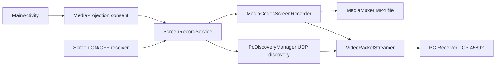
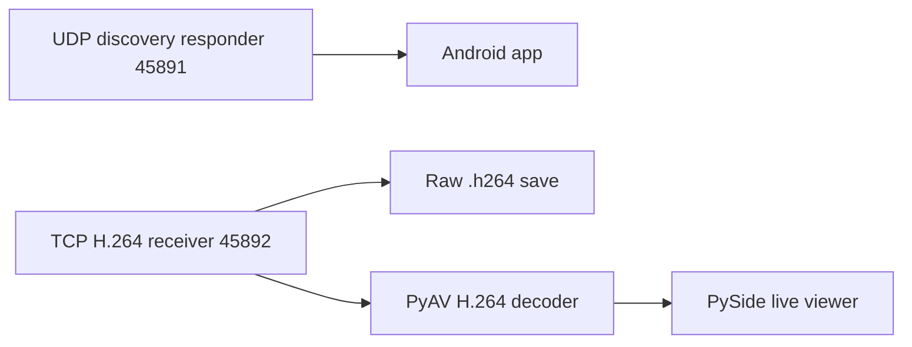

# Architecture

## Android components

## PC components

## Stream protocol

The Android app sends encoded H.264 packets to the PC receiver over TCP.

Header format, big endian:

| Field | Size |
| --- | --- |
| Magic `SSP1` | 4 bytes |
| Packet type | 1 byte |
| Flags | 1 byte |
| Reserved | 2 bytes |
| PTS microseconds | 8 bytes |
| Payload size | 4 bytes |

Packet types:

- `1`: codec config, SPS/PPS in Annex B format
- `2`: H.264 frame, Annex B format

Flags:

- `1`: key frame

## Design decisions

- MediaCodec is used instead of MediaRecorder so recording and streaming can share one encoded video pipeline.
- MP4 recording uses MediaMuxer on Android.
- Stream fallback is automatic: if PC is unavailable, the streamer drops packets and local MP4 recording continues.
- Discovery uses UDP broadcast because it works in normal WiFi and most phone hotspot networks.

